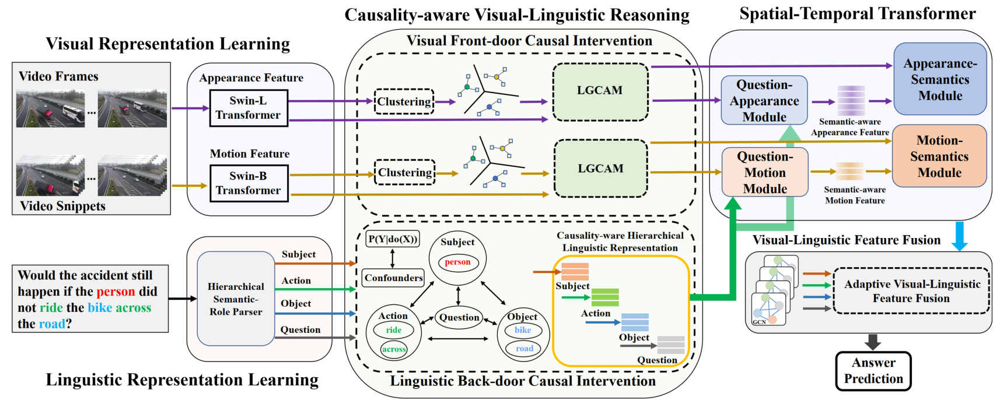

# CMCIR
Cross-Modal Causal Relational Reasoning for Event-Level Visual Question Answering     
Preprint 2022
For more details, please refer to our paper [Cross-Modal Causal Relational Reasoning for Event-Level Visual Question Answering](https://arxiv.org/abs/2207.12647)     

<a href="https://orcid.org/0000-0002-9423-9252" target="orcid.widget" rel="noopener noreferrer" style="vertical-align:top;">orcid.org/0000-0002-9423-9252</a>

Homepage: [https://yangliu9208.github.io/home/](https://yangliu9208.github.io/home/)

### Abstract
Existing visual question answering methods tend to capture the spurious correlations from visual and linguistic modalities, and fail to discover the true casual mechanism that facilitates reasoning truthfully based on the dominant visual evidence and the correct question intention. Additionally, the existing methods usually ignore the complex event-level understanding in multi-modal settings that requires a strong cognitive capability of causal inference to jointly model cross-modal event temporality, causality, and dynamics. In this work, we focus on event-level visual question answering from a new perspective, i.e., cross-modal causal relational reasoning, by introducing causal intervention methods to mitigate the spurious correlations and discover the true causal structures for the integration of visual and linguistic modalities. Specifically, we propose a novel event-level visual question answering framework named Cross-Modal Causal RelatIonal Reasoning (CMCIR), which consists of three essential components named causality-aware visual-linguistic reasoning module, spatial-temporal transformer, and visual-linguistic feature fusion module, to achieve robust casuality-aware visual-linguistic question answering. To uncover the causal structures for visual and linguistic modalities, the novel Causality-aware Visual-Linguistic Reasoning (CVLR) module is proposed to collaboratively disentangle the visual and linguistic spurious correlations via elaborately designed front-door and back-door causal intervention modules. To discover the fine-grained interactions between linguistic semantics and spatial-temporal representations, we build a novel Spatial-Temporal Transformer (STT) that builds the multi-modal co-occurrence interactions between visual and linguistic content. To adaptively fuse the causality-ware visual and linguistic features, we introduce a Visual-Linguistic Feature Fusion (VLFF) module that leverages the hierarchical linguistic semantic relations as the guidance to learn the global semantic-aware visual-linguistic representations adaptively. Extensive experiments on large-scale event-level urban dataset SUTD-TrafficQA and three benchmark real-world datasets TGIF-QA, MSVD-QA, and MSRVTT-QA demonstrate the effectiveness of our CMCIR for discovering visual-linguistic causal structures and achieving robust event-level visual question answering.

### Model
        
Figure 1: Framework of our proposed CMCIR.        

### Requirements
-python3.7
-numpy
-pytorch
-[pytorch-geometric](https://pytorch-geometric.readthedocs.io/en/latest/notes/installation.html)    

### Datasets
We conducted our experiment on large-scale event-level urban dataset [SUTD-TrafficQA](https://sutdcv.github.io/SUTD-TrafficQA/#/) and three benchmark real-world datasets [TGIF-QA](https://github.com/YunseokJANG/tgif-qa), [MSVD-QA](https://github.com/xudejing/video-question-answering) and [MSRVTT-QA](https://github.com/xudejing/video-question-answering). The preprocessing steps are the same as the offcial ones. Please find more details from these datasets.        

### Codes
Code will be released when it is fully prepared, please stay focusing on!     

### Citation
If you use this code for your research, please cite our paper.      
```
@article{liu2022cross,
  title={Cross-Modal Causal Relational Reasoning for Event-Level Visual Question Answering},
  author={Liu, Yang and Li, Guanbin and Lin, Liang},
  journal={arXiv preprint arXiv:2207.12647},
  year={2022}
}
``` 
If you have any question about this code, feel free to reach me (liuy856@mail.sysu.edu.cn)      
